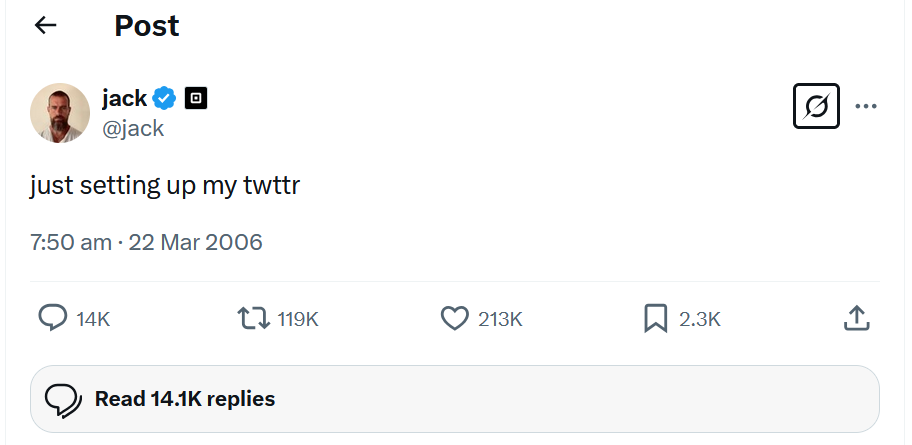

# Just setting up my twttr



When texting or tweeting, it’s not uncommon to shorten words to save time or space, as by omitting vowels, much like Twitter was originally called twttr. In a file called `twttr.py`, implement a program that prompts the user for a `str` of text and then outputs that same text but with all vowels (A, E, I, O, and U) omitted, whether inputted in uppercase or lowercase.

??? Hints
    - Recall that a `str` comes with quite a few methods, per [docs.python.org/3/library/stdtypes.html#string-methods](https://docs.python.org/3/library/stdtypes.html#string-methods).
    - Much like a `list`, a `str` is “iterable,” which means you can iterate over each of its characters in a loop. For instance, if `s` is a `str`, you could print each of its characters, one at a time, with code like:
```
for c in s:
    print(c, end="")
```
## Before You Begin
From the root of your repository execute `cd src/loops` So your current working directory is ...		
```
src/loops $:
```
Next execute
```
code twttr.py
```
to make a file called `twttr.py` where you’ll write your program.

## How to Test
Here’s how to test your code manually:

1. Run your program with `python twttr.py`. Type `Twitter` and press Enter. Your program should output:
```
Twttr   
```
2. Run your program with `python twttr.py`. Type `What's your name?` and press Enter. Your program should output:
```
Wht's yr nm?
```
3. Run your program with `python twttr.py`. Type `CS50` and press Enter. Your program should output:
```
CS50
```
### Pytest 
You can execute the below to check your code using `pytest` from the root directory.

```
pytest .\tests\loops\twttr.py
```

A green output from running the test means it was successful. A red output means there is a bug in your code that you need to fix.

## How to Submit

From github desktop or the command line, commit your changes and push them to your repository.

### Codespaces
If you are using codespaces, you can commit your changes directly from the Codespace interface. Click on the Source Control icon in the left sidebar, then click on the "..." button and select "Commit to main". Enter a commit message and click "Commit".

#### Codespace terminal or your local terminal. 

!!! Note
    You will need to have installed `git-scm` for this to work locally

At the `/datatypes $` prompt in your terminal:
```
git add -A 
```
Add all changed files in the repository to be committed
```
git commit -m "your message here"
```
Commit all changes in the REPO with the comment “your message here“ note: If the file is not complete, adjust the comment to describes what is being committed
!!! Note
    Remember to replace "your message here" with a meaningful commit message that describes your changes.

```
git push 
```
Push all changes to the repo.